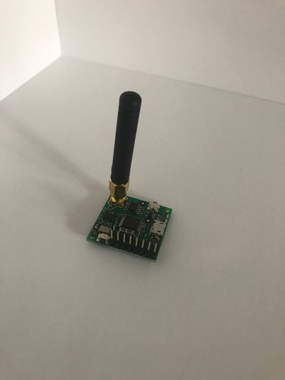
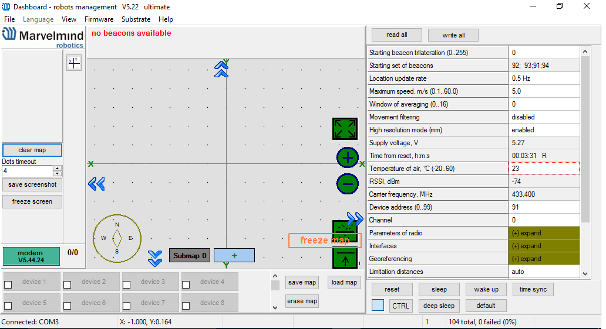
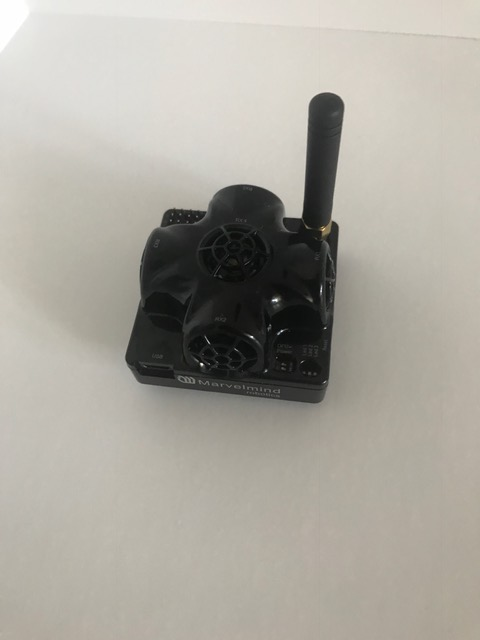
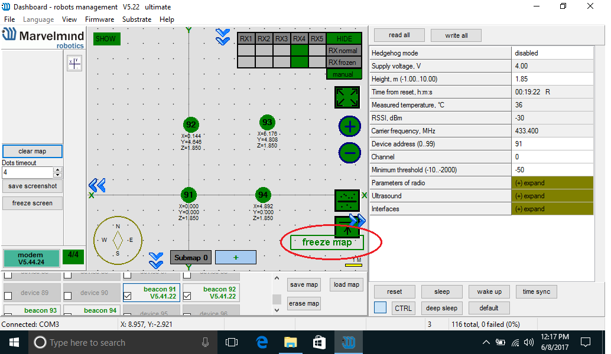
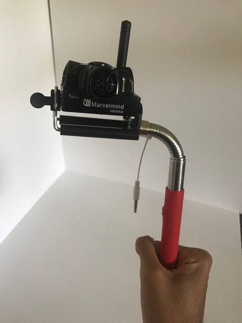

##Marvelmind

###What is Marvelmind?

Marvelmind Indoor Navigation System is an off-the-shelf indoor navigation system designed for
providing precise (+-2cm) location data to autonomous robots, vehicles (AGV) and copters.

###How to set up the Marvelmind environment.

Go to [Google Docs Link Gregor] and click the link to download the *Dashboard SW v5.16 + Beacon SW v5.51 + Modem SW 5.51* file. After installation completes, open the dashboard file in the downloaded folder. The dashboard interface should give you an error as shown in *Figure 1*.

*Figure 1: Marvelmind error if modem is not plugged in.*

The error in *Figure 1* essentially signals that you have not plugged in the Marvelmind modem into your Windows PC yet, which is shown in *Figure 2*. Without this modem, you will not be able to use the Marvelmind dashboard to set up your Marvelmind navigation environment.

*Figure 2: Marvelmind modem.*

Once the modem is plugged into the Windows PC using a USB cable, with the Marvelmind dashboard running, the error should go away, and you will be presented with a coordinate plane, as demonstrated in *Figure 3*. There should be an error at the top left corner of the coordinate plane stating that not enough beacons are available. This error is due to the fact that you have not turned on enough beacons (minimum of 2) required to track movement with the dashboard environment. You now need to set up stationary and mobile beacons, as needed, to fit your navigational needs.

*Figure 3: Marvelmind coordinate plane.*

###How to set up stationary beacons in Marvelmind?

Marvelmind uses stationary beacons in order to track its mobile beacons. Any Marvelmind beacon, *Figure 4*, can be assigned the duty of being stationary or mobile, and it is up to you to decide how many beacons you would like to set up as stationary, or tracker, beacons. The larger the space you operate your environment in, the larger the amount of tracker beacons you should use. Keep in mind, the stationary beacons need to be a good distance apart, 3 meters is a good measure, and their recommended height is at least 1.85 meters. Therefore it is a good idea to mount the stationary beacons on stands of heights equal to or greater than 1.85 meters using velcro tape, as shown in *Figure 5*. 

*Figure 4: Marvelmind beacon.*

*Figure 5: Stand used to hold Marvelmind stationary beacon in place above recommended height.*

Now that you have set up your beacons on top of the stands. You may turn them on one by one. The beacons will start showing up on the Marvelmind dashboard, they take approximaely 8 seconds to wake up, as green circles with random device addresses assigned to them, consisting of numbers between 1 and 99, as shown in *Figure 6*. Keep track of the numbers Marvelmind assigns to each beacon, as you can name them to your liking. You can now assign one of the beacons the coordinates (0,0,Z), Z being the height of the beacon, by making it the starting beacon. The menu to the right of the dashboard interface, *Figure 7*, has an option labeled **starting beacon tritalateration**. You can type the device address number of whichever beacon you would like to use as your point (0,0, Z) in terms of the x and y value, respectibly. The other beacons will now remap themselves around this beacon on the dashboard interface.

*Figure 6: Marvelmind beacon list.*

*Figure 7: First cell shows starting beacon trilateration.*

At the bottom of your dashboard there is a list of all 99 beacon addresses, as shown in *Figure 8*. Find each beacon the device address number of which you would like to change, and click on it and the menu presented to you on the right side of the dashboard interface should change to look like *Figure 9*. In this new menu, click the **Device address** option and type in whatever number, between 1 and 99, that you would like to assign to this specific beacon, as long as another active beacon does not have it. The beacon should now change device addresses. Do this for as many beacons as you like.

*Figure 8: List of beacons circled red.*

*Figure 9: Menu you are presented with once you click a specific beacon to edit its settings.*

Now that you have assigned your beacons device addresses to your liking and have picked a starting beacon, you can click the option **freeze map** at the bottom right corner of the coordinate plane, *Figure 10*, and lock your beacons as stationary on the Marvelmind screen. Now you can move on to introducing mobile beacons that will be picked up by these stationary beacons to your environment.

*Figure 10: "Freeze map" option circled red.*

###How to set up mobile beacons in Marvelmind?

Once you have frozen the stationary beacons, you can now start introducing mobile beacons to Marvelmind. These mobile beacons can be mounted on whatever object you are trying to measure the movement of using Marvelmind, such as a robot. In order to introduce a beacon as a mobile beacon. Simply turn a beacon, or as many as you would like, on in addition to the frozen beacons, it will show up green just like the other beacons on the dashboard. Find the beacon number in the list shown in *Figure 9* of this newly started beacon, renumber it like demonstrated earlier, or keep the address if that's your preference. Click on the beacon number in the list and the menu on the right should change again, as demonstrated in *Figure 8*. Now, there should be an option at the top of this menu labeled *Hedgehog mode* and it should be **disabled**. Click on it so it says **enabled**. The beacon should now turn blue on the coordinate plane, as shown in *Figure 11*.

*Figure 11: Hedgehog beacon and its setting.*

You can now move the beacon around as it is mobile, while the frozen beacons remain stationary. Now the Marvelmind python program, which you will find in the dashboard package that you downloaded from google docs, can be used to track the coordinates of this beacon, essentially tracking whatever object it is mounted on. If you are mounting other objects on top of the device you are tracking in addition to the beacon, you will need holders for mobile beacons that allow the beacons to be mounted higher up than everything else mounted on the device, so that they do not block the sound recepters on the beacons, since that's the stationary beacons' way of receiving feedback from the mobile ones. *Figure 12* shows a selfie stick that can be purchased from any local store that seems to function very well as a holder for the beacons. Just make sure the beacon is not too far into the holder, because the recepters may become blocked off.

*Figure 12: Selfie stick used as a hedgehog beacon holder (note how the sound receptors are elevated above the grip of the beacons).*

**Using the python program:**

In order to get coordinates of the beacons from the python program. Unplug the modem from the Windows PC after you have frozen your stationary beacons and introduced the mobile beacon(s). Plug it into your mac computer. Navigate to the directory that houses your marvelmind.py program in terminal, which by default is the Marvelmind dashboard folder. Run the marvelmind.py program included in the dashboard package that you downloaded by typing
	
	python marvelmind.py
	
into Terminal. The program should start outputting coordinates of the remote beacons, as shown in *Figure 13*. You can now move the remote beacon(s) around and the marvelmind.py program will pick up on the movement, even if the dashboard on the Windows PC says there is no connection. You can now implement these coordinates into your python programs.

*Figure 13: Marvelmind coordinates presented as units of (X,Y,Z, and time elapsed since the program has been running).*

