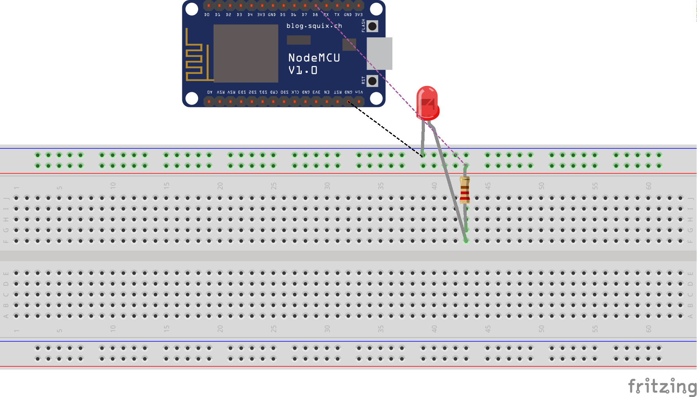
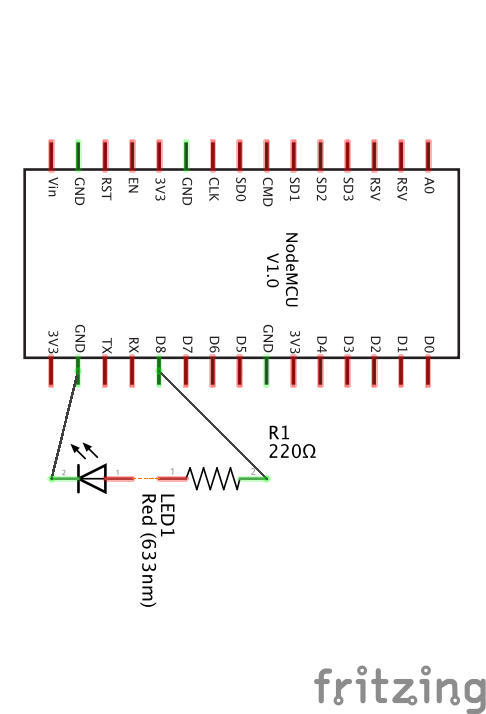

# ESP8266

When working with a external hardware such as the NodeMCU you will
find a lot of information on the internet about it. It is a bit
difficult at times to assess what you need to program it. You are
exposed to many choices. A NodeMCU typically comes with Lua. However
you have many other choices.  Such choices include multiple
programming languages such as Lua, MicroPython, Arduino/C, Go and
others.

As all of them are slightly different you need to identify which works
best for you. In addition you need to install images, programs and
libraries that support your specific language choice.
 
For our first experiments we will be using MicroPython. This choice is
motivated by the fact that Python is a well established and easy to
learn programming language. Recently many educational institutions are
offering Python as an introductory programming language making this
choice even mor compelling
 
To simplify the setup and use of the esp8266 for MicroPython we
developed an easy to use commandline tool that allows users to set up
their computer and interact more easily with the board. We believe
that the interface is so simple that it can also be used in STEM
activities and not just in the university or by advanced hobbyists.

### Installation of the robot Interafce

To more easily interface with the robot we have developed a convenient
program that is installed as part of a command tool called cloudmesh.

#### Install Cloudmesh Robot 

**The install from pip is not yet working**

> To install the robot command you simply type

>	     $ pip install cloudmesh.robot

> This will install a program `cms` on your computer that allows you to
> easily communicate with the robot. 

Developers are however encouraged to work with the source code. Thus
you will need to first obtain it as follows

	$ mkdir github
	$ cd github
	$ git clone https://github.com/cloudmesh/cloudmesh.common.git
	$ git clone https://github.com/cloudmesh/cloudmesh.cmd5.git
	$ git clone https://github.com/cloudmesh/cloudmesh.robot.git
	$ cd cloudmesh.robot
	$ make source

To test out if the command has been
installed please type

    $ cms robot welcome
    
If everything works you should see an ASCII image of R2D2 and
C3PO. Next, we still have to install some additional programs before
you can use other commands. 

The installation of these commands requires administrator access. In
case you are not an administrator you can temporarily change yourself
as an administrator in the OSX configuration windows.  Than you can
execute the command

	$ cms robot osx install
	
In addition you will need to install the OSX driver for the USB
interface to the esp8266. This is achieved with

	$ cms robot osx driver
	
Now please change your account to be again a standard account.
	
Now you **MUST REBOOT** the machine. Without rebooting you will not be
able to use the USB drivers.

Once you have successfully installed the drivers and the commands you
can look at the manual page of the robot command with

    $ cms help robot

You will see a manual page like this:

     Usage:
        robot welcome
        robot osx install
        robot osx driver
        robot image fetch
        robot probe [--format=FORMAT]
        robot flash erase [--dryrun]
        robot flash python [--dryrun]
        robot test
        robot run PROGRAM
        robot credentials set SSID USERNAME PASSWORD
        robot credentials put
        robot credentials list
        robot login
        robot set PORT NOT IMPLEMENTED
        robot ls [PATH]
        robot put [-o] SOURCE [DESTINATION]
        robot get PATH
        robot rm PATH
        robot rmdir PATH
        robot dance FILE IPS
        robot inventory list [--cat] [--path=PATH] [ID]

    Arguments:
        FILE   a file name

    Options:
        -f      specify the file

### Testing the board

Next is to connect a esp8266 with theUSB cable to the computer. After
you connected it, please press the reset button. Before we do anything
else with the board we test it out first. Once you have plugged it in,
you can execute the command

    $ cms robot probe

The output of this command provides you hopefully with a table similar to 
   
    +-----------+---------------------------+
    | Attribute | Value                     |
    +-----------+---------------------------+
    | chipid    | b' 0x00d0f9ec'            |
    | mac       | b' 5c:cf:7f:d0:f9:ec'     |
    | tty       | /dev/tty.wchusbserial1410 |
    +-----------+---------------------------+

Please note that you should only have one board attached to your computer.

### Flashing the image onto the robot board

Next we need to flash the image on the robot board. Naturally we need
to fetch the image first from the internet. We do this with the
command

    $ robot image fetch
    
This will fetch an image that contains MicroPython into your local
directory.

Next we need to *flash* the image on the board. Your board will look
something like this
    

[link with motor shield](https://www.amazon.com/KOOKYE-ESP8266-NodeMcu-ESP-12E-Expansion/dp/B01C6MR62E/ref=sr_1_3?ie=UTF8&qid=1498599901&sr=8-3&keywords=esp8266++doit)

[link](https://www.amazon.com/Adafruit-2821-Feather-HUZZAH-ESP8266/dp/B019MGW6N6/ref=sr_1_1?ie=UTF8&qid=1498599868&sr=8-1&keywords=esp8266++feather)

 [link](https://www.amazon.com/HiLetgo-Version-NodeMCU-Internet-Development/dp/B010O1G1ES/ref=sr_1_3?ie=UTF8&qid=1498599733&sr=8-3&keywords=esp8266)

You will need to connect your board to your computer with a USB
cable. The board has a microusb cable adapter.  Make sure to obtain
one as it may not come with the robot.  The board may come with a
preinstalled image such as Lua or some custom image from the
vendor. As we try to program the robot in python let us place
micropython on the board. This requires a number of steps.

#### Erase the chip 

First we need to erase the chip. To follow our instructions place the
chip towards you as shown in the figure. E.g. the USB connector points
to you.

You must allow the chip to be erased by holding both buttons on the
chip and than letting the right button be released first and than the
left button. You will see a blue LED flashing once.  Now you can flash
the chip with the command

    $ cms robot flash erase

#### Putting Python on the chip

To put python on the chip you need to again prepare the board for
flashing while pressing both buttons and releasing the right button
before releasing the left button.

Now ou can place python with the command 

    $ cms robot flash python 
    

#### Testing if it works

To test running a pyton program execute

    $ cms robot test
    
Be careful as it overwrites the file `test.py`.

#### Execute an arbitrary program

Lets assume you have placed a program in the file `prg.py` than you can 
run it with the following command

    $ cms robot run prg.py

#### Interactive Python shell on the board

To get into the interactive python shell on the board you need to make
sure that you have reset the esp8266 once after flashing. You need to
press the reset button.

Than you can use the following command to login

    $ cms robot login
    
    
#### Cleaning an reinstalling a development version

IN case you are a developer and you need to modify the source code, we
found that it is sometimes necessary to clean your development
directory and libraries. The easiest way to do this is to go to the
repository that you like to reinstall. Let us assume it is
*cloudmesh.robot*. Than the following commands will clean the
repository

    $ cd cloudmesh.robot
    $ pip uninstall cloudmesh.robot
    
 Do the pip unisntall as many times till you see an error that no more
 cloudmesh.robot versions can be found. Than execute
 
    $ make clean
    
After this you can reinstall it with 
    
    $ python setup.py install; pip install -e .

the -e flag is optional, but allows you to change the code without the
need of recompiling. A very useful feature in python.

### NodeMCU ESP12 Dev Kit Pin Definition

For V1.0

  

The GPIO numbers of teh NodeMCU, do
not correspond with the actual numbers used in micropythons pin
library. The numbers are as follows:

| Pin/GPIO | NodeMCU |
|----------|---------|
|      15  |    D8   |

### LED

#### Program

	import machine
	led = machine.Pin(15,machine.Pin.OUT)
	led.high()
	led.low()
	
	
	import machine
	led = machine.Pin(15,machine.Pin.OUT)
	while True:
		led.high()
		time.sleep(0.5)
		led.low()
		time.sleep(0.5)
		
		

## Alternative boords

### HUZZAH Feather esp8266

Many different 8266 based alterantive boards exist. One of these
boards is the HUZZAH Feather. IT behaves the same as the other boards,
but ay be using differnt drivers and USB ports. The *cms robot*
command line tool is clever enough to identify automatically if it is
attached and uses the appropriate settings. More documentation about
this board can be found at

* [doc](https://learn.adafruit.com/adafruit-feather-huzzah-esp8266/using-nodemcu-lua)

This site has also many other examples and you can search for them
with keywords such as feather, esp8266, micropython.

An example on how to use the LED on the *feather* is documented at

* [Feather HUZZAH ESP8266](https://learn.adafruit.com/micropython-basics-blink-a-led/blink-led)

To place micropython on the feather you can plug in the to th eusb
port. The good thing about this board is that you do not need to press
any buttons as it detects the upload nicely. If not make sure to reset
it or for flasshing press both buttons. You can do the following:

Probe the board with

    cms robot probe
    
Erasing the feather is simple as it has a bild in mechanism to detect
if it is going to be erased. Hence no reset button needs to be pressed

    cms robot flash erase

Get the python image

    cms robot fetch python

    
Flashing is conducted with 460800 baud, it will take about 15 seconds. 
After flashing you should try to login

    cms robot login

Set the boudrate to 115200
 
    CTRL-A CTRL-B
    
    *** baud: 
    
type in 

    115200 <ENTER>
    
Make sure that echo is switched to OFF 
    
    CTRL-A CTRL-C
    
toogles it.
    
   
Now you should see 
    
    >>>
    
    
Try typing in

    print("Hello")
    
